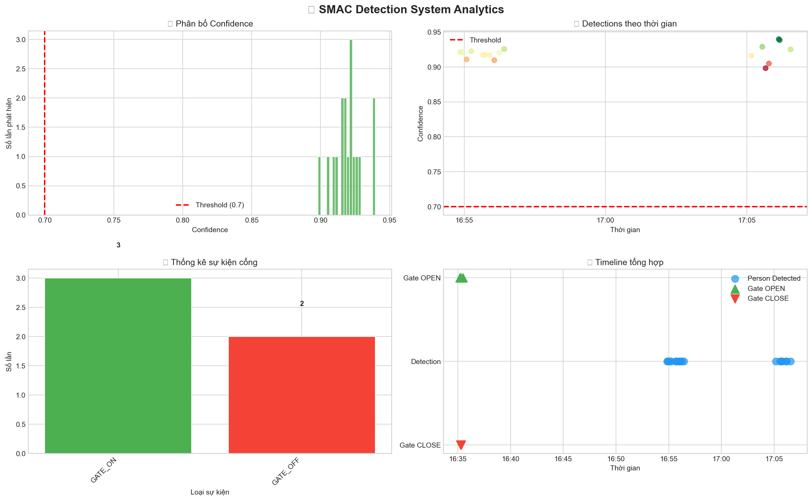

# SMAC - Security Monitoring Access Control

Hệ thống phát hiện người tự động điều khiển cổng sử dụng YOLO11.

## Demo

https://github.com/user-attachments/assets/demo1.mp4

<video src="database/demo1.mp4" controls width="100%"></video>

## Cấu trúc

```
SMAC/
├── AI_model/           # YOLO model (yolo11n.pt)
├── backend/            # Node.js server
├── frontend/           # Web dashboard
├── src/                # Python detection system
│   ├── detection_system.py
│   ├── gate_controller.py
│   ├── database.py
│   └── telegram_helper.py
├── database/           # SQLite databases
├── data_images/        # Detection images
├── run.bat             # One-click launch
└── requirements.txt
```

### Mô tả các file trong `src/`

| File | Chức năng |
|------|-----------|
| `detection_system.py` | **Module chính** - Xử lý webcam realtime, YOLO11 person detection, Flask API streaming (port 8000), tích hợp gate controller và Telegram alerts |
| `gate_controller.py` | **State Machine** - Điều khiển cổng với 2 trạng thái (CLOSED/OPEN). Mở cổng sau 10s phát hiện người liên tục (conf ≥ 0.7), đóng sau 0.5s không có người |
| `database.py` | **SQLite Database** - Lưu trữ log phát hiện người (person_count, datetime, confidence, image_path). Hỗ trợ thống kê và truy vấn |
| `telegram_helper.py` | **Telegram Bot** - Gửi thông báo và ảnh cảnh báo khi phát hiện người. Hỗ trợ auto-detect Chat ID |

## Database Analytics



## Tính năng

- 📹 **Webcam realtime** - Stream video với bounding box
- 🎯 **Person detection** - YOLO11n phát hiện người
- 🚪 **Auto gate control** - Mở cổng sau 5s phát hiện người, đóng sau 2s không có người  
- 📊 **Database logging** - Lưu log sự kiện vào SQLite
- 📱 **Telegram alerts** - Gửi thông báo khi mở cổng (tùy chọn)
- 🌐 **Web dashboard** - Giao diện web điều khiển

## Yêu cầu

- Python 3.8+
- Node.js 16+ (cho dashboard)
- Webcam

## Chạy hệ thống

### Cách 1: One-click (khuyến nghị)

```bash
run.bat
```

### Cách 2: Chạy thủ công

```bash
# Terminal 1: Python detection
cd src
python detection_system.py

# Terminal 2: Node.js dashboard (optional)
cd backend
node server.js
```

## URLs

- **Python Detection Server**: http://localhost:8000
- **Web Dashboard**: http://localhost:3000

## Cấu hình Telegram (tùy chọn)

Set environment variables:

```bash
set TELEGRAM_BOT_TOKEN=your_bot_token
set TELEGRAM_CHAT_ID=your_chat_id
```

Hoặc sửa trực tiếp trong `src/telegram_helper.py`.

## Logic cổng

- **OPEN**: Phát hiện người liên tục >= 5 giây
- **CLOSE**: Không có người >= 2 giây (debounce)
