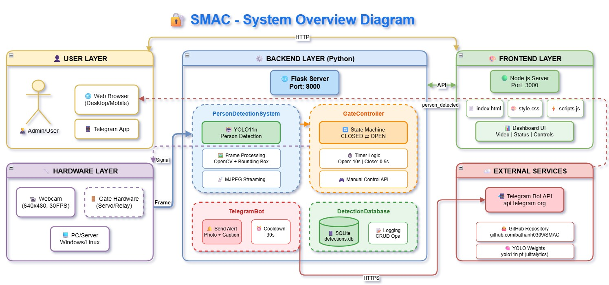

# SMAC - Security Monitoring Access Control

SMAC (Security Monitoring Access Control) là hệ thống giám sát an ninh tự động kiểm soát cổng ra vào dựa trên việc phát hiện người sử dụng trí tuệ nhân tạo (YOLO11)

```
Thành viên: Nguyễn Bá Thành, Võ Đức Hiếu, Hoàng Thị Hương Giang
```

Đối với dự án SMAC trong **môn Công nghệ Phần mềm**, tôi đề xuất sử dụng: **Hybrid Approach: Waterfall + Agile Elements**

### Lý do:

| Yếu tố | Giải pháp |
|--------|-----------|
| **Yêu cầu môn học** | Waterfall phases cho documentation |
| **Thực tế phát triển** | Agile iterations cho coding |
| **Team size nhỏ** | Không cần full Scrum ceremonies |
| **Thời gian giới hạn** | Timeboxed phases |

### Sơ đồ tổng quan hệ thống (System Overview)


---

https://github.com/user-attachments/assets/0690f03e-9104-4892-8d91-02bf9c63523b


## Cấu trúc

```
SMAC/
├── AI_model/               # YOLO model (yolo11n.pt)
├── backend/                # Node.js server
├── frontend/               # Web dashboard
├── src/                    # Python detection system
│   ├── detection_system.py # Xử lý webcam realtime, YOLO11 person detection, Flask API streaming
│   ├── gate_controller.py  # Điều khiển cổng (CLOSED/OPEN). OPEN sau 10s phát hiện người liên tục (conf ≥ 0.7)
│   ├── database.py         # SQLite Database - Lưu trữ log phát hiện người, hỗ trợ thống kê và truy vấn
│   └── telegram_helper.py  # Telegram Bot - Gửi thông báo và ảnh cảnh báo khi phát hiện người. 
├── database/               # SQLite databases
├── data_images/            # Detection images
├── run.bat                 # One-click launch
└── requirements.txt
```


## Database Analytics


## Tính năng

- 📹 **Webcam realtime** - Stream video với bounding box
- 🎯 **Person detection** - YOLO11n phát hiện người
- 🚪 **Auto gate control** - Mở cổng sau 5s phát hiện người, đóng sau 2s không có người  
- 📊 **Database logging** - Lưu log sự kiện vào SQLite
- 📱 **Telegram alerts** - Gửi thông báo khi mở cổng (tùy chọn)
- 🌐 **Web dashboard** - Giao diện web điều khiển

```
Python Detection Server: http://localhost:8000
Web Dashboard: http://localhost:3000
```

## Cấu hình Telegram (tùy chọn)

Set environment variables:

```bash
set TELEGRAM_BOT_TOKEN=your_bot_token
set TELEGRAM_CHAT_ID=your_chat_id
```

Hoặc sửa trực tiếp trong `src/telegram_helper.py`.

## Logic cổng

- **OPEN**: Phát hiện người liên tục >= 5 giây
- **CLOSE**: Không có người >= 2 giây (debounce)

## Yêu cầu chức năng (Functional Requirements)

| ID | Yêu cầu | Mô tả | Độ ưu tiên |
|----|---------|-------|------------|
| **01** | Phát hiện người | Hệ thống phải phát hiện người trong khung hình camera với độ chính xác ≥ 70% | Cao |
| **02** | Điều khiển cổng tự động | Mở cổng sau 10s phát hiện người liên tục, đóng sau 0.5s không có người | Cao |
| **03** | Stream video | Cung cấp video stream realtime qua web browser | Cao |
| **04** | Điều khiển thủ công | Cho phép mở/đóng cổng thủ công qua giao diện web | Trung bình |
| **05** | Gửi cảnh báo Telegram | Gửi thông báo và ảnh khi phát hiện người | Trung bình |
| **06** | Lưu log phát hiện | Lưu thông tin phát hiện vào database | Cao |
| **07** | Xem lịch sử | Hiển thị lịch sử các lần phát hiện | Trung bình |
| **08** | Hiển thị trạng thái | Hiển thị trạng thái cổng, số người, độ tin cậy | Cao |
| **09** | Lưu ảnh phát hiện | Lưu ảnh khi phát hiện người (mỗi 10s) | Thấp |
| **10** | Countdown timer | Hiển thị thời gian đếm ngược trước khi mở cổng | Thấp |

## Yêu cầu phi chức năng (Non-functional Requirements)

| ID | Loại | Yêu cầu | Mô tả | Metric |
|----|------|---------|-------|--------|
| **01** | Performance | Độ trễ xử lý | Thời gian từ capture đến hiển thị | ≤ 100ms |
| **02** | Performance | Frame rate | Tốc độ xử lý video | ≥ 25 FPS |
| **03** | Performance | Độ chính xác | Accuracy của person detection | ≥ 70% confidence |
| **04** | Reliability | Uptime | Thời gian hoạt động liên tục | 99% |
| **05** | Reliability | Fault tolerance | Khả năng phục hồi lỗi | Tự khởi động lại |
| **06** | Usability | Giao diện | Responsive, dễ sử dụng | Mobile-friendly |
| **07** | Usability | Thời gian học | Thời gian làm quen | ≤ 30 phút |
| **08** | Security | Authentication | Bảo vệ API | Token-based (tùy chọn) |
| **09** | Security | Data protection | Bảo vệ dữ liệu | Mã hóa credentials |
| **10** | Scalability | Concurrent users | Số người dùng đồng thời | ≥ 10 clients |
| **11** | Portability | Cross-platform | Hỗ trợ đa nền tảng | Windows, Linux |
| **12** | Maintainability | Modular design | Kiến trúc module hóa | Separation of concerns |


## 📚 Tài liệu tham khảo

1. Sommerville, I. (2016). Software Engineering (10th Edition)
2. Pressman, R. S. (2014). Software Engineering: A Practitioner's Approach
3. Schwaber, K., & Sutherland, J. (2020). The Scrum Guide
4. YOLO Documentation: https://docs.ultralytics.com/

---
